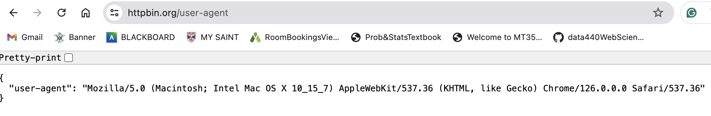
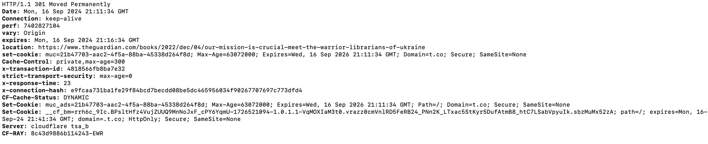
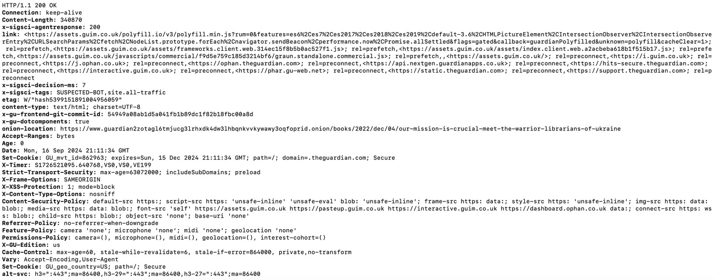

<h1 align = "center">HW 1 - Web Science Intro</h1>

<h3 align = "center">Courtney Maynard</h3>
<h3 align = "center">DATA 440, Fall 2024</h3>
<h3 align = "center">September 24th</h3>

## Question 1
*Consider the 'bow-tie' structure of the web and the following links A - G. Draw the resulting directed graph showing how the nodes are connected to each other. For the graph list the nodes (in alphabetical order) that are each of the categories.*

### Answer


#### Node Categories:
- Strongly Connected Components (Blue): A, B, C, G
- IN (Pink): M, O, P
- OUT (Orange): D, H
- Tendrils (Yellow): I, K, L
   - I can reach OUT
   - K is reachable from I, which can reach OUT
   - L can reach OUT
- Tubes (Red): N
   - N is a tube because it connects an IN node (M) with an OUT node (D), bypassing the SCC
- Disconnected (Green): E, F
  
### Discussion
To construct this graph, I first sketched all the nodes on paper as I read them. Then, once I realized how they were clustered, I created a visualization on the computer and set it up so the components were easily identifiable by color-coding them. I started by finding the strongly connected components to determine which nodes were in each category. I traced through each node to see which others it reached and determined that *A*, *B*, *C*, and *G* could all reach each other directly. Next, I looked for the nodes that were strictly **OUT** or **IN** from the **SCC**, which led me to *O*, *M*, and *P* as **IN** nodes, and *D* and *H* as **OUT**. I noticed that *M* was connecting to *N*, which then connected to *D*, and since *N* is **IN** and *D* is **OUT**, that made *N* a tube. I identified *E* and *F* as disconnected because they don't connect to other nodes. I identified the remaining nodes, *I*, *K*, and *L* as tendrils because they were either directed to **OUT** (*I* and *L*) or connected to another tendril (*K*), but could not reach the **SCC**. I identified no tendrils reachable from **IN**, since *N* ended up being a tube. 

## Question 2
*Load the URI in the browser and take a screenshot. Then, in a single curl command, issue a HEAD HTTP request for the second URI. Show the HTTP response headers, follow any redirects, and change the User-Agent HTTP request field to DATA 440_691. Show the commands and results*

### Answer
**Part A**


**Part B**
```console
(base) courtneymaynard@Courtneys-MacBook-Pro-2 ~ % curl -I -L -A "DATA 440_691" https://t.co/KSHFYLmmB0
```




### Discussion
**Part A:** The URI resulted in the User-Agent request string that is shown above. The different parts of the string indicate different things about the computer and browser. This string indicates to websites that the request is coming from a Google Chrome browser on a Mac computer running macOS version 10.15.7.

**Part B:** The curl command consists of several parts: -I fetches only the HTTP headers, -L makes curl follow any redirects that occur, and -A "DATA 440_691" sets the user-agent string to DATA 440_691. The results can be understood as follows:

HTTP/1.1 301 Moved Permanently indicates that the content of the URI has been moved to a new location. Additional information is provided regarding the date and time of the request, cookies, caching, and the performance of the server. The headers also include the location of the new URL for the content, and indicate that the connection to the server will be kept alive in case there are any additional requests. 

The second portion of headers are the result of redirect from the original URI, HTTP/1.1 200 OK indicates that this was a successful request. We are provided information regarding the size of the content body in bytes, Content-Length: 340870, and that the content is HTML encoded in UTF-8. Many of the headers provide information regarding cache, cookies, and the security of the connection. One interesting header is x-sigsci-tags: SUSPECTED-BOT, site.all-traffic, which indicates the request has been flagged as potential bot activity.

## Question 3
*Write a Python program to find links to PDFs in a webpage. Show that the program works on 3 different URIs.*

### Answer
```python
#IMPORTS
import sys
import requests
import re

from bs4 import BeautifulSoup
from urllib.parse import urljoin

#FUNCTIONS

'''
getHTMLContent(captured_uri)
    input: captured_uri - string uri link passed into program via command line
    output: text representation of all the html content at the requested link
'''
def getHTMLContent(captured_uri):
    html_content = requests.get(captured_uri)
    return html_content.text
    
'''
create_soup(html_of_page)
    input: text of html of the requested page
    output: beautiful soup object to parse
'''
def create_soup(html_of_page):
    try:
        soup = BeautifulSoup(html_of_page, 'html.parser')
        return soup
    except:
        print('Error creating soup object.')
    

'''
action_on_links(each_link)
    input: content found within all of the A tags on a page

    - gets the link itself, requests the next uri
    - determines if the link references a PDF file and if it does, print the required information
    - if the link does not reference a PDF, nothing is printed 

    output: does not return any objects
'''
def action_on_links(each_link, base_uri):
    # get the link itself from the whole tag+link representation
    actual_link = each_link.get('href')

    # skip empty links
    if not actual_link:
        return
    
    # join together the base with relative link found, for internal page links
    actual_link = urljoin(base_uri, actual_link)

    # some links are doi and the format isn't recognized in parsing
    if actual_link.startswith("http://doi:"):
        actual_link = f"https://doi.org/{actual_link[11:]}"
        
    # request the NEXT uri 
    next_uri = requests.get(actual_link, allow_redirects=True)

    # use the Content-Type HTTP response header to determine if the link references a PDF file
    content_type_link = next_uri.headers.get('Content-Type', '')

    # check if it references a pdf
    if 'application/pdf' in content_type_link:
        #print the original URI (found in the parent HTML page)
        print('URI: ', actual_link)

        #print the final URI (after any redirects)
        print('Final URI: ', next_uri.url)

        #print the number of bytes in the PDF file
        num_bytes = next_uri.headers.get('Content-Length')
        print('Content Length:', num_bytes, 'bytes \n')

    return


#BEGINNING OF RUNNING PROGRAM
captured_uri = sys.argv[1]

#PART ONE: SET UP FOR PARSING
html_of_page = getHTMLContent(captured_uri) # get the html content of the page
soup = create_soup(html_of_page) # create soup object

#PART TWO: EXTRACT LINKS AND PERFORM REQUIRED ACTIONS
all_links = soup.find_all('a', href=True) # for some tested pages, there was no href inside the A tag

for each_link in all_links:
    action_on_links(each_link, captured_uri) # some links are relative, so have to pass in the base
```
**Proving that the program works on the following URIs:**

https://alexandernwala.com/files/teaching/fall-2022/week-2/2018_wsdl_publications.html
```console
(base) courtneymaynard@Courtneys-MacBook-Pro-2 data440 % python3 get_pdfs.py https://alexandernwala.com/files/teaching/fall-2022/week-2/2018_wsdl_publications.html
URI:  http://www.cs.odu.edu/~mln/pubs/ht-2018/hypertext-2018-nwala-bootstrapping.pdf
Final URI:  https://www.cs.odu.edu/~mln/pubs/ht-2018/hypertext-2018-nwala-bootstrapping.pdf
Content Length: 994153 bytes 

URI:  http://www.cs.odu.edu/~mln/pubs/ipres-2018/ipres-2018-atkins-news-similarity.pdf
Final URI:  https://www.cs.odu.edu/~mln/pubs/ipres-2018/ipres-2018-atkins-news-similarity.pdf
Content Length: 18995885 bytes 

URI:  http://www.cs.odu.edu/~mln/pubs/ipres-2018/ipres-2018-jones-off-topic.pdf
Final URI:  https://www.cs.odu.edu/~mln/pubs/ipres-2018/ipres-2018-jones-off-topic.pdf
Content Length: 3119205 bytes 

URI:  http://www.cs.odu.edu/~mln/pubs/ipres-2018/ipres-2018-jones-archiveit.pdf
Final URI:  https://www.cs.odu.edu/~mln/pubs/ipres-2018/ipres-2018-jones-archiveit.pdf
Content Length: 2639215 bytes 

URI:  http://www.cs.odu.edu/~mln/pubs/jcdl-2018/jcdl-2018-nwala-scraping-serps-seeds.pdf
Final URI:  https://www.cs.odu.edu/~mln/pubs/jcdl-2018/jcdl-2018-nwala-scraping-serps-seeds.pdf
Content Length: 2172494 bytes 

URI:  http://www.cs.odu.edu/~mln/pubs/jcdl-2018/jcdl-2018-kelly-private-public-web-archives.pdf
Final URI:  https://www.cs.odu.edu/~mln/pubs/jcdl-2018/jcdl-2018-kelly-private-public-web-archives.pdf
Content Length: 2553579 bytes 

URI:  http://www.cs.odu.edu/~mln/pubs/jcdl-2018/jcdl-2018-aturban-archivenow.pdf
Final URI:  https://www.cs.odu.edu/~mln/pubs/jcdl-2018/jcdl-2018-aturban-archivenow.pdf
Content Length: 3998654 bytes 

URI:  http://www.cs.odu.edu/~mln/pubs/jcdl-2018/jcdl-2018-alam-archive-banner.pdf
Final URI:  https://www.cs.odu.edu/~mln/pubs/jcdl-2018/jcdl-2018-alam-archive-banner.pdf
Content Length: 596000 bytes 

```

https://yhe15.people.wm.edu/publication.html
```console
(base) courtneymaynard@Courtneys-MacBook-Pro-2 data440 % python3 get_pdfs.py https://yhe15.people.wm.edu/publication.html                                          
URI:  https://arxiv.org/pdf/2408.12665
Final URI:  https://arxiv.org/pdf/2408.12665
Content Length: 444750 bytes 

```

https://cristianofanelli.com/publications/
```console
(base) courtneymaynard@Courtneys-MacBook-Pro-2 data440 % python3 get_pdfs.py https://cristianofanelli.com/publications/
URI:  https://ml4physicalsciences.github.io/2023/files/NeurIPS_ML4PS_2023_250.pdf
Final URI:  https://ml4physicalsciences.github.io/2023/files/NeurIPS_ML4PS_2023_250.pdf
Content Length: 543834 bytes 

URI:  https://www.epj-conferences.org/articles/epjconf/pdf/2021/05/epjconf_chep2021_04011.pdf
Final URI:  https://www.epj-conferences.org/articles/epjconf/pdf/2021/05/epjconf_chep2021_04011.pdf
Content Length: 24 bytes 

```

### Discussion
To write this program, I started by creating the beautiful soup object and ensuring I could get a representation of the HTML content of the page. Then, I created several functions, to make my code easier to understand, and I created a function for the actions that needed to be performed on each link so that I could place it cleanly inside a for loop. While coding and testing my action_on_links function, I realized there were several peculiarities in possible 'links' found, that did not occur in the test website given. Some links on other sites would not contain a URI at all, others would be relative links, and some links to DOIs were not formatted in a way that could be parsed by the requests.get() command. As I ran into errors thrown by these formatting differences, I added conditions into my function to ensure that whatever content is found inside the <a> tag could be handled properly. Throughout the process, I created many debugging statements and learned about different errors possible from the requests.get() command. 
