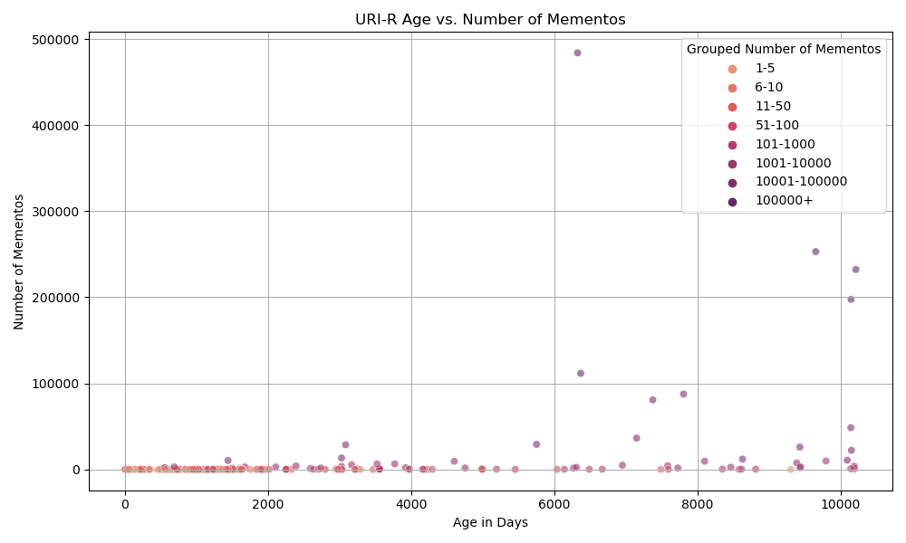
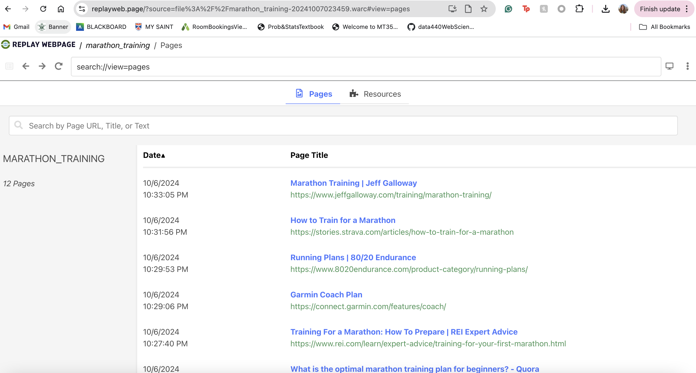
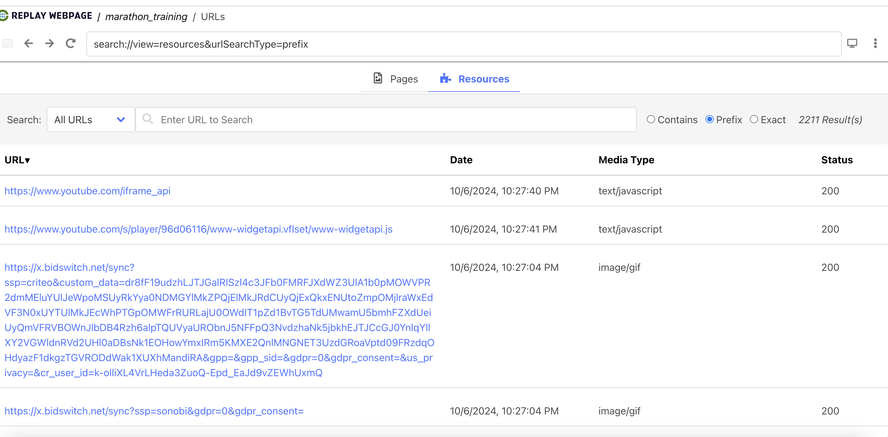

<h1 align = "center">HW 2 - Archiving the Web</h1>

<h3 align = "center">Courtney Maynard</h3>
<h3 align = "center">DATA 440, Fall 2024</h3>
<h3 align = "center">October 8th, 2024</h3>

## Q1: Collect URIs From Tweets

### Parts One and Two Code: Collecting Tweets + Extracting Links from Tweets

I created one program to both collect the tweets and extract the links from the tweets corresponding to a given keyword.

```console
(base) courtneymaynard@Courtneys-MacBook-Pro-2 data440 % python3 collect_uris_tweets.py
```

```python
# IMPORTS
from playwright.sync_api import sync_playwright
from scrape_twitter import get_auth_twitter_pg
from scrape_twitter import get_search_tweets
from util import write_tweets_to_jsonl_file

import json
import gzip

# FUNCTIONS
'''
collect_tweets()
    inputs: none 
    ouputs: saved compressed json file of tweets
    - uses playright to collect the tweets from twitter according to a specified keyword
    - saves the tweets to a file with the associated keyword in it's name
'''
def collect_tweets():
    
    playwright = sync_playwright().start()
    browser_dets = get_auth_twitter_pg(playwright)

    if( len(browser_dets) != 0 ):
        tweets = get_search_tweets(browser_dets, "keyword", max_tweets=1000)
        write_tweets_to_jsonl_file('all_tweets_FINAL_keyword.json.gz', tweets['tweets'])

    playwright.stop()


'''
extract_links()
    inputs: none
    outputs: text file of all links associated with tweets corresponding to the keyword query
    - loads in JSON file and keeps track of how many tweets were from the keyword search
    - for each tweet, find the url entitity if it exists, and discard all irrelevant primarily
    audio/visual link, keeping all other links found
    - outputs the validity ratio to understand how many links result from every twitter request batch
    - writes and saves all links into a test file
'''
def extract_links():

    tweet_content = []

    # load in the data from the jsonl file
    with gzip.open('all_tweets_FINAL_keyword.json.gz', 'rb') as infile:
        counter = 1
        for tweet in infile:
            tweet = json.loads(tweet.decode())
            tweet_content.append(tweet)
            print('reading tweets: ', counter)
            #print('the tweet: ', tweet)
            counter+=1

    print('length of number of tweets before link extraction: ', len(tweet_content))
    tweet_links = []

    for each_tweet in tweet_content:
        if 'entities' in each_tweet and 'urls' in each_tweet.get('entities', []):
            for link in each_tweet['entities']['urls']:

                # if links are from twitter or go to youtube, twitch, soundcloud, netflix, spotify or tiktok, exclude them
                links_excluded = ['x.com', 'twitter.com', 'youtu.be', 'youtube.com', 'twitch.com', 'soundcloud.com', 'netflix.com', 'spotify.com', 'tiktok']

                if any(excluded in link['expanded_url'] for excluded in links_excluded):
                    print('link excluded: ', link['expanded_url']) #ensuring excluded links caught
                else:
                    tweet_links.append(link['expanded_url'])
    
    # trying to determine how many tweets needed to result in 1000 valid and unique links
    print('number of links: ', len(tweet_links))
    print('valid ratio: ', len(tweet_links)/len(tweet_content))

    #print(tweet_links)

    # write links into a text file for use in a shell script to resolve the uris
    with open('all_tweets_FINAL_keyword_links.txt', 'w') as f:
        for link in tweet_links:
            f.write(link + '\n')

    return

if __name__ == "__main__":
    collect_tweets()

    print('tweets collected!')

    extract_links()

    print('tweets extracted!')

```

After several attempts, I realized that Twitter had pretty strict rate limits, which meant that in order to search for more tweets I had to wait ~12 minutes. Because of this, it was not feasible for me to set up a loop to iterate through the different keywords, and I had to manually re-run the program for each new word I wanted to search. Thus, I ended up with 30+ named files corresponding to all of the collected tweets, and created another program to combine the links in all the files.

```console
(base) courtneymaynard@Courtneys-MacBook-Pro-2 data440 % python3 combine_links.py
```
                                    
```python
'''combining all links from the various text files into one file'''

single_files = ['all_tweets_FINAL_america_links.txt', 'all_tweets_FINAL_article_links.txt', 'all_tweets_FINAL_artificialintelligence_links.txt', 'all_tweets_FINAL_baseball_links.txt', 'all_tweets_FINAL_boston_links.txt', 'all_tweets_FINAL_campaign_links.txt', 'all_tweets_FINAL_chatgpt_links.txt', 'all_tweets_FINAL_chemistry_links.txt', 'all_tweets_FINAL_climate_links.txt', 'all_tweets_FINAL_college_links.txt', 'all_tweets_FINAL_covid_links.txt', 'all_tweets_FINAL_crime_links.txt', 'all_tweets_FINAL_datascience_links.txt', 'all_tweets_FINAL_debate_links.txt', 'all_tweets_FINAL_emergency_links.txt', 'all_tweets_FINAL_fashion_links.txt', 'all_tweets_FINAL_flu_links.txt', 'all_tweets_FINAL_generativeai_links.txt', 'all_tweets_FINAL_hiking_links.txt','all_tweets_FINAL_hurricanes_links.txt', 'all_tweets_FINAL_journal_links.txt', 'all_tweets_FINAL_kamala_links.txt', 'all_tweets_FINAL_learn_links.txt', 'all_tweets_FINAL_machinelearning_links.txt', 'all_tweets_FINAL_northcarolina_links.txt', 'all_tweets_FINAL_playoffs_links.txt', 'all_tweets_FINAL_poll_links.txt', 'all_tweets_FINAL_recipe_links.txt','all_tweets_FINAL_register_links.txt', 'all_tweets_FINAL_science_links.txt', 'all_tweets_FINAL_space_links.txt', 'all_tweets_FINAL_stocks_links.txt', 'all_tweets_FINAL_travel_links.txt', 'all_tweets_FINAL_trend_links.txt', 'all_tweets_FINAL_trump_links.txt', 'all_tweets_FINAL_unitedstates_links.txt', 'all_tweets_FINAL_voting_links.txt', 'all_tweets_FINAL_weather_links.txt', 'all_tweets_FINAL_wellness_links.txt' ]
combined_file = 'all_combined_links_FINAL.txt'

with open(combined_file, 'w') as outfile:
    for each_file in single_files:
        with open(each_file, 'r') as infile:
            outfile.write(infile.read())

```

### Commentary:

I began by writing the code to collect the tweets and testing in small batches, then looking at the raw output of the tweets in order to understand how to process the tweets and get the links from tweets that did contain links. On these small batches, I tested the validity rate - how many tweets actually have links, and valid links at that. I realized some keywords resulted in more links than others, but the average probability of a tweet having a link was about 10%, meaning to get 1000 links (not considering their ability to resolve to a URI-R or their uniqueness) I would need to gather 10,000 tweets. I ran into many issues with only being able to request between 500-700 tweets before Twitter was no longer letting me search for tweets. Thus, I began manually searching new tweets every 12-15 minutes. This process took me about three days, as I ended up having to request over 40,000 tweets in order to get 1000 unique URI-Rs. If I were to do this project again, I would set up a loop to iterate through keywords and set up a ~12 minute time out between requests so I wouldn't have to manually request each time.

### Parts Three and Four Code: Resolved URIs to Final Target URI
```console
(base) courtneymaynard@Courtneys-MacBook-Pro-2 data440 % ./resolve_uris.sh all_combined_links_FINAL.txt resolved_uris_FINAL.txt
```

```shell
#!/bin/bash

# provide file to load in from and to save to via the command line argument
load_file="$1"
save_file="$2"

# delete any previously saved copy of save file
> "$save_file"

# for each URI:
while IFS= read -r uri; do
    
    final_uri="$uri"

    # keeps iterating through the URIs until you reach the final resolved one
    while true; do
        # fetch the headers using curl
        response=$(curl -IL --silent --max-time 10 --location "$final_uri" 2>/dev/null)
        if [ $? -ne 0 ]; then
            echo "Request to $final_uri timed out or failed"
            break
        fi

        # get the last HTTP status and then check if it's 200
        http_status=$(echo "$response" | grep HTTP | tail -n 1 | awk '{print $2}')

        # if the status is 200, check what the resolved URL is and then save into the file
        if [ "$http_status" == "200" ]; then
            final_uri=$(echo "$response" | grep -i "^Location:" | tail -n 1 | cut -d ' ' -f2-)
            if [[ "$final_uri" =~ ^http ]]; then
                echo "$final_uri" >> "$save_file"
            fi
            break
        fi

        # check for a new resolved URI
        resolved_uri=$(echo "$response" | grep -i "^Location:" | tail -n 1 | cut -d ' ' -f2-)

        # if there’s no further resolved URI, we have found the final location and can end the loop
        if [ -z "$resolved_uri" ]; then
            echo "No further redirection for $final_uri"
            break
        fi

        # updates the final_uri, but it might not actually be 'final': the loop continues
        final_uri="$resolved_uri"
    done
    
done < "$load_file"

echo "final URIs are now saved to $save_file"
```
```console
(base) courtneymaynard@Courtneys-MacBook-Pro-2 data440 % ./sort_unique_uris.sh resolved_uris_FINAL.txt unique_uris_FINAL.txt
```

```shell
#!/bin/bash

# provide file to load in from and to save to using command line
resolved_uris="$1"
unique_resolved_uris="$2"

> "$unique_resolved_uris"

# sort and filter all unique URIs
sort -u "$resolved_uris" > "$unique_resolved_uris"

echo "unique links have been saved to $unique_resolved_uris"
```

### Commentary:
I created a shell script to work with all the links and use curl to request their headers. I chose the approach of iteratively requesting the headers, checking the HTTP status to see if a successful status is returned, checking for a new resolved URI, and if the URI is not the final location, repeating the loop. I had some problems with unpacking shortened URLs, such as bit.ly or tinylink, so I put in extra checks that the URI resolved to an http or https before saving it to the file. Not every link could be resolved - some links were protected, forbidden, or behind some wall which meant I could not access them through crawling. After resolving all of the URIs, I then sorted and identified all the unique URI-Rs, saving them into a file called unique_uris_FINAL. I ended up with 1046 URI-Rs.

---

## Q2: Get TimeMaps for Each URI

### Code:
```console
(base) courtneymaynard@Courtneys-MacBook-Pro-2 data440 % ls -l ./memgator-darwin-amd64
-rw-r--r--@ 1 courtneymaynard  staff  8814576 Oct  6 20:42 ./memgator-darwin-amd64
(base) courtneymaynard@Courtneys-MacBook-Pro-2 data440 % chmod +x ./memgator-darwin-amd64
(base) courtneymaynard@Courtneys-MacBook-Pro-2 data440 % ./memgator_execute.sh
```

```shell
#!/bin/bash

file_of_links="unique_uris_FINAL.txt"
num_links=1

# want to save the number of mementos during this process, 
# so each file does not need to be revisted in a seperate script

memento_count_output="memento_counts.txt"
: > "$memento_count_output"

while IFS= read -r link; do
    # the json timemap information will be saved to specific numbered json file
    uniq_timemap_file="timemap_files_hw2/link_${num_links}.json"

    # use memgator to gather output and route to a json file
    ./memgator-darwin-amd64 -F 2 -f JSON "$link" > "$uniq_timemap_file"

    # save off the number of mementos found, then zip and save the json file
    memento_count=$(jq '.mementos.list | length' "$uniq_timemap_file")
    gzip "$uniq_timemap_file" 

    # append count to memento count file
    # outputs zero if no mementos were found 
    echo "${memento_count:-0}" >> "$memento_count_output"

    ((num_links++))
done < "$file_of_links"

```

### Commentary:

I first ensured that I had executable permissions for the memgator software, as seen in my command line excerpts above. I saved each URI-Rs timemap information to a specific numbered json file, to make it easier to reference back the URI at different points of time during the analysis. I decided to save both the compressed json file and the number of mementos for each URI-R with one program and in one step, to limit the number of times I would need to re-access the json file later. Additionally, it served as an easy 'sanity test' to see if I was collecting the json information correctly because I knew how many mementos to expect for a test subset of links I used. In the cases that there were no mementos found, I outputed zero so that the correct numbering would still hold in the memento count file, instead of essentially 'skipping' that link. This part of the project took the longest to run; I set up my computer to run overnight and it took about 8 hours to gather the timemaps for all 1000 links.

## Q3: Analyze Mementos Per URI-R and Q4: Analyze Datetimes of Mementos 

### Code:
```python
# IMPORTS
import json
import gzip
import pandas as pd
import matplotlib.pyplot as plt
import seaborn as sns

from datetime import datetime

'''
group_memento_counts()
    input: none
    output: text file of grouped counts of mementos, i.e. how many URI-Rs have each number of mementos
    - sorts the counts of mementos and groups them, then saves to an output file
'''
def group_memento_counts(): 
    with open('memento_counts.txt', 'r') as file:
        counts = [int(line.strip()) for line in file]

    # sort the counts
    sorted_counts = sorted(counts)
    counts_groups = {}

    for count in sorted_counts:
        if count in counts_groups:
            counts_groups[count] += 1
        else:
            counts_groups[count] = 1

    # save in a file where i can manually read and bin them
    with open('memento_grouped_counts.txt', 'w') as output_file:
        for count, total in counts_groups.items():
            output_file.write(f'{count} --> {total}\n')

'''
get_first_memento_date()
    input: json file of the timemap for the URI-R
    output: the oldest datetime occurence for that URI-R
    - opens the zipped json files and retrieves the oldest datetime
    - when the json is empty/doesn't contain and datetime information, it catches the decode error
    and outputs that there are no mementos
    - keeps track of even those URI-Rs with no mementos so that the ordering of URI-Rs is maintained
'''
def get_first_memento_date(json_file):
    try:
        with gzip.open(json_file, 'rt', encoding='utf-8') as f:
            data = json.load(f)
        
        # ensure that there are mementos, handle cases where there are no mementos
        if 'mementos' in data and 'first' in data['mementos']:
            oldest_datetime = data['mementos']['first']['datetime']
            return oldest_datetime
        else:
            return None
    except json.JSONDecodeError: #handle cases where there are no mementos
        print('No Mementos.')
        return None
    
'''
save_age_and_number()
    input: none
    output: csv file of the URI-R index, age of oldest memento, and number of mementos for each URI-R,
    - finds the corresponding json.gz timemap file for each URI-R
    - utilizes the get_first_memento_date() function to retrieve the oldest datetime
    - calculate the age in days, if there are no mementos i.e. no oldest datetime, age is saved as zero
    - collect all results and save as csv
'''
def save_age_and_number():
    with open('memento_counts.txt', 'r') as file:
        memento_counts = [int(line.strip()) for line in file.readlines()]

    age_and_num_results = [] # store data we are about to retrieve

    # for each URI-R/link
    for each_link in range(len(memento_counts)):
        json_file = f'timemap_files_hw2/link_{each_link + 1}.json.gz' 
        
        first_datetime = get_first_memento_date(json_file)
        
        # calculate age in days, account for case of no mementos i.e. zero days
        if first_datetime:
            first_date = datetime.fromisoformat(first_datetime[:-1])
            age_days = (datetime.utcnow() - first_date).days
        else:
            age_days = 0

        num_mementos = memento_counts[each_link]
        
        # append results to the list
        age_and_num_results.append({'age_days': age_days, 'num_mementos': num_mementos})

    # save to dataframe and download as csv 
    age_and_num_df = pd.DataFrame(age_and_num_results)
    age_and_num_df.to_csv('memento_age_and_number.csv', index=True)


# RUNNING ANALYSIS FUNCTIONS
group_memento_counts()
save_age_and_number()


# CREATING ANALYSIS PLOT
num_age_analysis_df = pd.read_csv('memento_age_and_number.csv')
age_greater_zero = num_age_analysis_df[num_age_analysis_df['num_mementos'] > 0]
#print(len(age_greater_zero)) # this value should be 1046-431 = 615 ---- it is!

# make colors for bin categories!
age_greater_zero['memento_category'] = pd.cut(age_greater_zero['num_mementos'],
    bins=[1, 5, 10, 50, 100, 1000, 10000, 100000, float('inf')],
    labels=['1-5', '6-10', '11-50', '51-100', '101-1000', '1001-10000', '10001-100000', '100000+'])


plt.figure(figsize=(10, 6))
sns.scatterplot(data=age_greater_zero, x='age_days', y='num_mementos', hue='memento_category', palette = 'flare', alpha=0.6)

plt.title('URI-R Age vs. Number of Mementos')
plt.xlabel('Age in Days')
plt.ylabel('Number of Mementos')

plt.grid()
plt.legend(title='Grouped Number of Mementos')
plt.tight_layout()

# save figure and show 
plt.savefig('age_vs_num_mementos.png')
plt.show()

```

### Q3 Results:

The table shows the number of URI-Rs that have a number of mementos in the bin range.

|Number of Mementos|Number of URI-Rs|
|:---|:---|
|0|431|
|1|233|
|2-10|184|
|11-100|112|
|101-1000|40|
|1001-10000|29|
|10001-100000|12|
|100000+|5|


### Q3 Commentary:

I decided to create one file for the analysis of date-times and number of mementos. Using the saved json files from the previous steps, I was able to find the oldest datetime associated with each URI-R. Since I gave each link its own numbered json file, it was easier to match up the datetime and number of mementos with each URI-R and save it in a dataframe, then csv, for analysis.

*Q: What URI-Rs had the most mementos? Did that surprise you?*

Five URI-Rs had over 100k mementos.
|URI-R|Number of Mementos|
|:---|:---|
| https://naturalnews.com/ | 111628 |
| https://www.boston.com/ | 232180 |
| https://www.dailymail.co.uk/ | 252943 |
| https://www.eventbrite.com | 483904 |
| https://www.nj.com:443/ | 197561 |

I does not surprise me that four out of the five URI-Rs (all except eventbrite) with the highest number of mementos are news sites, as they are likely archived often in order to retain the content of all of the news stories. Since these sites deal with a high volume of content, it is logical that they would have many mementos over time to capture all of the content and save it. Eventbrite is a website which posts different events occuring around the world, which also makes sense for having a high number of mementos because after events occur, the content is likely archived to maintain a history of events. Due to the sheer volume of events posted about or hosted through Eventbrite, a large number of mementos makes sense. 

### Q4 Results:



### Q4 Commentary:
*Q: What can you say about the relationship between the age of a URI-R and the number of its mementos?*

Older URI-Rs tend to have more mementos than younger URI-Rs, however, not all old URI-Rs have many mementos. Most younger pages have a small number of mementos, while the number for older pages is more varied. Older pages have likely seen more updates and timestamps over time, however, there could be some pages that have stayed unchanged for long periods and may not have as many mementos associated with them. Thus, as a URI-R gets older, it is more likely it will have more mementos associated with it, but there is not a strictly linear relationship between age and the number of mementos; the graph appears to follow a slightly stretched exponential distribution relating age of URI-Rs to the number of mementos.

*Q: What URI-R had the oldest memento? Did that surprise you?*

The URI-R with the oldest memento, 10214 days (almost 28 years), is https://www.boston.com/. Looking at the oldest version of the page, it doesn't surprise me. It is a site for local news and updates about the city of Boston and at the time of creation, served as a digital repository for the type of updates you would find in your local paper. It has evolved a little more throughout the past two decades but is still an online source regarding activities, events, and news relating to Boston. It makes sense that upon the creation of the web, people began moving news from paper to the internet, allowing it to be accessible anywhere.

The URI-R with the second oldest memento, 10196 days, is https://io.net/. This site was created to help companies start an online presence. It makes logical sense that this would be one of the oldest URI-Rs, as others without technical experience who want to create websites would have to utilize a service like io.net. 

*Q: How many URI-Rs had an age of < 1 week, meaning that their first memento was captured the same week you collected the data?*
```console
(base) courtneymaynard@Courtneys-MacBook-Pro-2 data440 % python3 less_than_week.py
[51, 128, 27, 8, 10, 3]
the number of URI-Rs less than a week old:  227
```

```python
import pandas as pd

age_num_df = pd.read_csv('memento_age_and_number.csv')

counts = []
for age in range(1, 7):
    counts.append(len(age_num_df[age_num_df['age_days'] == age]))

print(counts)
print('the number of URI-Rs less than a week old: ', sum(counts))
```

There were 227 URI-Rs less than a week old. 

---

## Q5 Extra Credit: Explore Conifer and ReplayWeb.Page

### Results:

[Marathon Training Conifer Collection](https://conifer.rhizome.org/cbm_data_scie/marathon_training)

List of Pages Loaded From WARC Files


URLs Archived in WARC File


### Commentary:
*Q: Why did you choose this particular topic?*

I chose to look at sites relating to marathon training because I am training for the Richmond Marathon and I thought it would be interesting to look at archives of different sites to see how their training suggestions may have changed over time. However, I then realized that Conifer actually allows you to manually archive pages, so I would not be looking 'into the past'. 

*Q: Did you have any issues in archiving the webpages?*

One issue I ran into was that the webpage loaded briefly in Conifer and I began archiving it, then within 5-10 seconds the screen showed 'Page Not Found' and I was unable to save the archive, even though I had captured it briefly. Additionally, I didn't like that you couldn't delete archives without deleting the entire collection.

*Q: Do the archived webpages look like the original webpages?*

The archived webpages do look like the original webpages, however, if you try to navigate to any link, even internal, you are not able to unless you archived that sub page/linked page as well.

*Q: How many URLs were archived in the WARC file? How does this compare to the number of Pages?*

I archived 12 pages, and 2211 URLs were archived. URLs pertaining to javascript and media elements, among others, were saved, contributing the the number nearly 200x the number of pages saved. 


