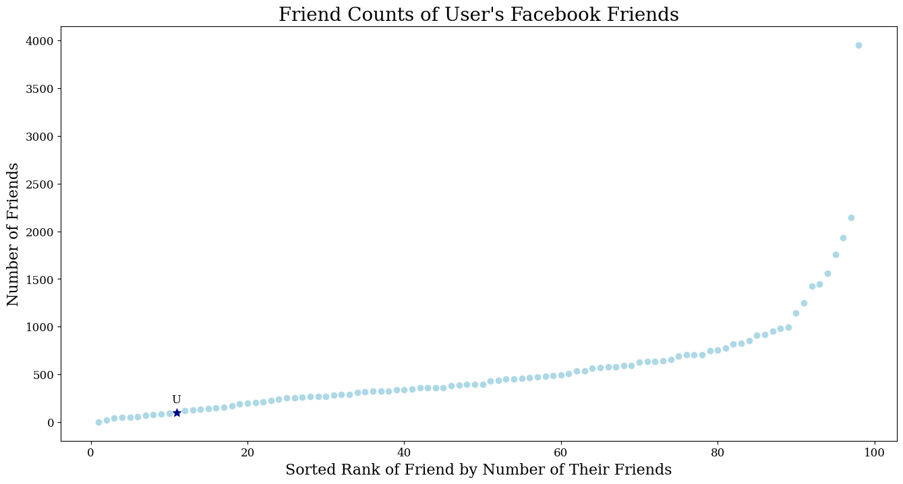

<h1 align = "center">HW 4 - Exploring Social Networks</h1>

<h3 align = "center">Courtney Maynard</h3>
<h3 align = "center">DATA 440, Fall 2024</h3>
<h3 align = "center">October 31st, 2024</h3>

## Q1: Friendship Paradox on Facebook
```python
import pandas as pd
import numpy as np
import matplotlib.pyplot as plt

'''PREPROCESSING'''
# load in the csv data file
friend_counts = pd.read_csv('acnwala_friends_friends.csv')
```

Q: What is the mean, standard deviation, and median of the number of friends that the user's friends have?
```python
# get rid of the quotation marks
friend_counts.columns = friend_counts.columns.str.replace('"', '')
friend_counts.columns = friend_counts.columns.str.replace(' ', '')

'''STATISTICS'''
# calculations
avg_friends = np.mean(friend_counts['FRIENDCOUNT'])
median_friends = np.median(friend_counts['FRIENDCOUNT'])
std_friends = np.std(friend_counts['FRIENDCOUNT'])

# print to command line
print("The average number of friends that the user's friends have is: ", avg_friends)
print("The median number of friends that the user's friends have is: ", median_friends)
print("The standard deviation of the number of friends that the user's friends have is: ", std_friends)
```
Answer: 
The mean number of friends that the user's friends have is 542.67, or approximately 543 friends. The standard deviation of the number of friends that the user's friends have is 536.67, or approximately 537 friends. The median number of friends that the user's friends have is 396.0. Based on this, the friendship paradox holds true because the user has 98 friends, and thus their friends have more friends on average. 


Q:  Does the friendship paradox hold for this user and their friends on Facebook?
```python
'''PREPARING FOR THE GRAPH'''
friend_counts = friend_counts.sort_values(by=['FRIENDCOUNT'])
# need to create an index which can be used as the x values in the graph
friend_counts['INDEX'] = range(1,len(friend_counts)+1)

num_of_friends = len(friend_counts)
print('The number of friends that the user has is: ', num_of_friends)

# determine where the user falls in the 'rank' of friend counts
friend_less = friend_counts[friend_counts['FRIENDCOUNT'] < 98]
friend_count_rank = len(friend_less)+1
print('This puts the user at position: ', friend_count_rank)

# must add the user's data to the dataframe so that when the additional point is plotted, 
# no data (another friend) is covered up
friend_counts.iloc[friend_count_rank-1] = ['User', num_of_friends, friend_count_rank]

'''CONSTRUCTING THE GRAPH'''
user_label = ['U']

plt.rcParams['font.family'] = 'serif'
plt.rcParams['font.sans-serif'] = 'Times New Roman' 
plt.rcParams['font.size'] = 12  

plt.figure(figsize=(16, 8))

plt.scatter(friend_counts['INDEX'], friend_counts['FRIENDCOUNT'], color='lightblue', marker='o')
plt.scatter(friend_count_rank, num_of_friends, color = 'navy', marker = '*', s = 75)

# want the label to be visible and not covered by any other points
move_text_x = -0.67
move_text_y = 100 
plt.text(friend_count_rank + move_text_x, num_of_friends+move_text_y, 'U', color = 'black')

plt.title("Friend Counts of User's Facebook Friends", color = 'black', size = 20)
plt.xlabel('Sorted Rank of Friend by Number of Their Friends', color = 'black', size = 16)
plt.ylabel('Number of Friends', color = 'black', size = 16)
plt.savefig('friend_counts_plot.png', bbox_inches='tight')
```


Answer:

Based upon the graph, yes, the friendship paradox holds for the user. A majority of their friends have more friends than they do - the user ranks 11 out of 99 (the total of their friends and themself). Thus, 88.88% of their friends have more friends than they do. Combined with the statistics from the first part of the question, the user has fewer friends on average than their friends do.
