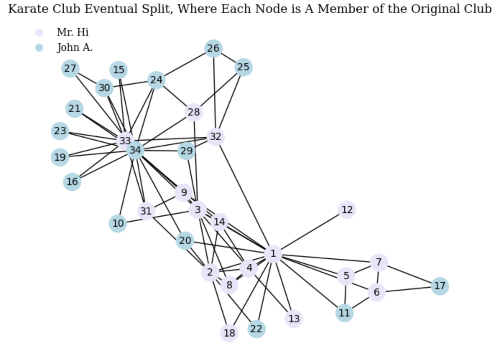

<h1 align = "center">HW 5 - Graph Partitioning</h1>

<h3 align = "center">Courtney Maynard</h3>
<h3 align = "center">DATA 440, Fall 2024</h3>
<h3 align = "center">November 12th, 2024</h3>

## Q1: Color Nodes Based on Final Split

### Code:
``` python
# IMPORT STATEMENTS
import numpy as np
import pandas as pd
from matplotlib import pyplot as plt
import seaborn as sns
import networkx as nx
import scipy
import matplotlib.patches as mpatches
import matplotlib.lines as mlines
from networkx import edge_betweenness_centrality, number_connected_components
import random
import dataframe_image as dfi

# Q1: COLORING THE SPLIT

# EXPLORING KARATE CLUB GRAPH
karate_base = nx.karate_club_graph()

print('The nodes (members), zero-based: ', list(karate_base.nodes), '\n')
print('The edges of the nodes (members): ', list(karate_base.edges), '\n')
print('The degrees of the connections between nodes (members): ', list(karate_base.degree))


# CREATING THE KARATE CLUB SPLIT BY DIFFERENT COLORED NODES

# creating data frame of the nodes, so that I can then decide a color for the nodes 
# and then iteratively add them to a new graph object to illustrate the split.
split_df = pd.DataFrame(columns = ['Node', 'Edges', 'Degree', 'Color'])

# need to renumber/'rename' each node to not be zero based in order to match the split
# shown in the lectures
for each_member in karate_base:

    # color according to split shown in lecture slides
    mr_hi_list = [1, 2, 3, 4, 5, 6, 7, 8, 9, 11, 12, 13, 14, 17, 18, 20, 22]
    if (each_member+1) in mr_hi_list:
        color = 'lavender'
    else:
        color = 'lightblue'

    # need to also add one to each node value in the edge pairs
    edges = karate_base.edges(each_member)
    corrected_edges = [(each_edge[0] + 1, each_edge[1] + 1) for each_edge in edges]
    
    split_df.loc[len(split_df)] = [each_member+1, corrected_edges, karate_base.degree(each_member), color]
    #print('Successfully added to dataframe')


# now, I will construct a new graph with all the right color splits and numbering
karate_split = nx.Graph()

for _, member in split_df.iterrows():
    node = member['Node']
    karate_split.add_node(node, color=member['Color'])
    edges = member['Edges']
    
    for edge in edges:
        karate_split.add_edge(edge[0], edge[1])

#print("Number of nodes in karate_split:", len(karate_split.nodes))
#print("Number of rows in split_df:", len(split_df))


# DRAW THE GRAPH
node_colors = split_df['Color']

plt.title('Karate Club Eventual Split, Where Each Node is A Member of the Original Club', fontsize=12, fontname='DejaVu Serif', color='black')

nx.draw_spring(karate_split, with_labels=True, node_color=node_colors, font_size = 10)

# making a legend by creating circlular symbols
lavender_circle= mlines.Line2D([], [], marker='o', color='w', label='Mr. Hi', markersize=10, markerfacecolor='lavender', markeredgewidth=2)
lightblue_circle = mlines.Line2D([], [], marker='o', color='w', label='John A.', markersize=10, markerfacecolor='lightblue', markeredgewidth=2)
plt.legend(handles=[lavender_circle, lightblue_circle], loc='upper left', fontsize=12, frameon=False, prop={'family': 'DejaVu Serif'})

plt.axis('off') 
plt.savefig('Karate_Split_Colored_Graph.png')
plt.show()

```


### Commentary:

To create a graph that matches the Karate Club before the split shown in lectures, I extracted the node attributes from the built-in karate club graph in NetworkX. I recognize I could have re-colored the nodes, however, I wanted the nodes to be numbered 1-34 instead of 0-33 to match the example, for clarity, and I decided it would give me some extra practice to both de-construct and construct a graph using node attributes. I started by creating a dataframe with all the necessary information to reconstruct a colorful graph, extracting the node itself, the list of edges, and the degrees for each node(member). I assigned a color to each node according to whether that member ended up in Mr. Hi's club or John A.'s club. I had to renumber the nodes by adding one, including the nodes inside the edge tuples. My completed dataframe then allowed me to construct a new graph by iteratively adding nodes of the correct color and filling in their edges (which adds nodes regardless of if the node had been added within the loop yet). Lastly, I drew the graph and chose the spring layout because it shows the split well. I created a legend for the different colors representing each club. 

**Q: How many nodes(students) eventually go with John and how many with Mr. Hi?**

16 students eventually will split to go with Mr. Hi. 17 nodes are colored lavender - the 16 students plus Mr. Hi, who is node 1. Thus, 16 also go with John. 

## Q2: Use the Girvan-Newman Algorithm to Illustrate The Split

### Code:
``` python
## Q2: GIRVAN-NEWMAN ALGORITHM

karate_splitting = karate_split.copy # made a copy of graph from above so the original one isn't changed

'''
drawing_splitting_grpah(graph, iteration, method)
    inputs: graph (networkX graph object) --> the graph to be drawn
            iteration (int) --> the number of times an edge has been removed from the graph
            method (string) --> whether the algorithm is removing edges with 'random' or 'highest' betweenness
    outputs: a figure, saved

    - this function takes the graph to be drawn and titles it according to the iteration of the 
    karate club splitting. it creates a network drawing with lavender for nodes (students) belonging
    to Mr. Hi's club and light blue for those belonging to John A's club.
    - it saves the network graph picture into a file named according to the iteration and method used
'''
def drawing_splitting_graph(graph, iteration, method):
    method = method
    
    node_colors = split_df['Color']

    plt.title(f'Karate Club Splitting Iteration {iteration}', fontsize=12, fontname='DejaVu Serif', color='black')
    
    nx.draw_spring(graph, with_labels=True, node_color=node_colors, font_size = 10)
    
    # making a legend by creating circlular symbols
    lavender_marker = mlines.Line2D([], [], marker='o', color='w', label='Mr. Hi', markersize=10, markerfacecolor='lavender', markeredgewidth=2)
    lightblue_marker = mlines.Line2D([], [], marker='o', color='w', label='John A.', markersize=10, markerfacecolor='lightblue', markeredgewidth=2)
    plt.legend(handles=[lavender_marker, lightblue_marker], loc='upper left', fontsize=12, frameon=False, prop={'family': 'DejaVu Serif'})
    
    plt.axis('off') 
    plt.savefig(f'Karate_Splitting_{method}_Iteration{iteration}_Graph.png')
    plt.show()

'''
highest_betweenness_deletion_method()
    inputs: none
    outputs: data_collection_df (a dataframe), and intermediary steps save a graph image

    - runs the Girvan-Newman algorithm for splitting graphs
        - calculate the edge betweenness for each edge
        - finds the maximum edge betweenness
        - removes the edge
        - repeat until the graph has split into two components
    - collects analysis data 
'''
def highest_betweenness_deletion_method():
    karate_splitting = karate_split

    method = 'Highest'
    iteration = 0
    
    # the data I want to collect for analysis sake. variables I'm saving are indicated below where applicable
    data_collection_df = pd.DataFrame(columns = ['NumEdgesBefore', 'MaxBetweenness', 'SecondHighestBetweenness', 'EdgeRemove', 'Node1', 'Node2', 'Node1Color', 'Node2Color'])
    num_connected = number_connected_components(karate_splitting)

    # the loop runs while the graph has not yet split into two connected components
    while num_connected < 2:
        iteration+=1
        print('Iteration', iteration)
        
        # calculating the edge betweenness and which edges correspond to this
        edge_between = edge_betweenness_centrality(karate_splitting)
        edge_between_df = pd.DataFrame.from_dict(edge_between, orient='index', columns = ['Betweenness'])
        edge_between_df.reset_index(inplace=True)
        edge_between_df.rename(columns={'index': 'Edge'}, inplace=True)
        num_edges_before = len(edge_between_df) # datacollection
        
        # finding the maximum edge betweenness
        max_between = max(edge_between_df['Betweenness']) # datacollection
        loc_max = edge_between_df['Betweenness'].idxmax() 
        edge_max = edge_between_df['Edge'][loc_max] # datacollection
    
        # find the second highest max betweenness, datacollection
        sorted_betweenness = edge_between_df['Betweenness'].sort_values(ascending=False)
        second_highest = sorted_betweenness.iloc[1]
        
        # data collection
        node1 = edge_max[0]
        node2 = edge_max[1]

        # data collection
        if node1 in mr_hi_list:
            node1_color = 'lavender'
        else:
            node1_color = 'lightblue'

        # data collection
        if node2 in mr_hi_list:
            node2_color = 'lavender'
        else:
            node2_color = 'lightblue'
    
        # remove the edge (* unpacks the tuple)
        karate_splitting.remove_edge(*edge_max)
    
        # save all of the data I want to analyze as a row in the dataframe. each iteration corresponds to a row
        data_collection_df.loc[len(data_collection_df)] = [num_edges_before, max_between, second_highest, edge_max, node1, node2, node1_color, node2_color]
    
        # draw and output the graph
        drawing_splitting_graph(karate_splitting, iteration, method)
        
        # update the number of connected components, the condition for the while loop
        num_connected = number_connected_components(karate_splitting)

    return data_collection_df

# run the deletion method which will save all of the iteration graphs
# also save and export the data collection dataframe
highest_data_collection_df = highest_betweenness_deletion_method()
dfi.export(highest_data_collection_df, 'Highest_Betweenness_DataFrame.png', table_conversion = 'matplotlib')

```
### Iterations:


### Commentary/Analysis:


**Q: How many iterations did it take the split the graph?**

It took 11 iterations in order for the graph to split into two connected components.

## Q3: Compare The Actual to The Mathematical Split

### Commentary/Analysis:

**Q: Did all of the same colored nodes end up in the same group? If not, what is different?**


## Extra Credit Q5: Delete Edges Randomly and Compare to Highest Betweenness 

### Code:
```python
''' EXTRA CREDIT Q5'''
random.seed(24)

'''
random_betweenness_deletion_method()
    inputs: none
    outputs: data_collection_df (a dataframe), and intermediary steps save a graph image

    - uses a random algorithm for splitting graphs
        - calculate the edge betweenness for each edge
        - randomly select an edge 
        - removes the edge
        - repeat until the graph has split into two components

    - collects analysis data 
'''
def random_betweenness_deletion_method():
    karate_splitting = karate_split

    method = 'Random'
    iteration = 0
    
    # the data I want to collect for analysis sake. variables I'm saving are indicated below where applicable
    data_collection_df = pd.DataFrame(columns = ['Iteration', 'NumEdgesBefore', 'RandomBetweenness', 'RandomEdgeRemove', 'Node1', 'Node2', 'Node1Color', 'Node2Color'])
    num_connected = number_connected_components(karate_splitting) 
    
    # the loop runs while the graph has not yet split into two connected components
    while num_connected < 2:
        iteration+=1
        print('Iteration', iteration)
        
        # calculating the edge betweenness and which edges correspond
        edge_between = edge_betweenness_centrality(karate_splitting)
        edge_between_df = pd.DataFrame.from_dict(edge_between, orient='index', columns = ['Betweenness'])
        edge_between_df.reset_index(inplace=True)
        edge_between_df.rename(columns={'index': 'Edge'}, inplace=True)
        num_edges_before = len(edge_between_df) # datacollection
        
        # choose a random edge to delete
        random_index = random.randint(0, len(edge_between_df) - 1)
        random_betweenness = edge_between_df['Betweenness'][random_index]  # datacollection
        random_edge = edge_between_df['Edge'][random_index] # datacollection
        
        # data collection
        node1 = random_edge[0]
        node2 = random_edge[1]
    
        # data collection
        if node1 in mr_hi_list:
            node1_color = 'lavender'
        else:
            node1_color = 'lightblue'

        # data collection
        if node2 in mr_hi_list:
            node2_color = 'lavender'
        else:
            node2_color = 'lightblue'
    
        # remove the edge (* unpacks the tuple)
        karate_splitting.remove_edge(*random_edge)

        # save all of the data I want to analyze as a row in the dataframe. each iteration corresponds to a row
        data_collection_df.loc[len(data_collection_df)] = [iteration, num_edges_before, random_betweenness, random_edge, node1, node2, node1_color, node2_color]
    
        # draw and output the graph
        drawing_splitting_graph(karate_splitting, iteration, method)
        
        # update the number of connected components, the condition for the while loop
        num_connected = number_connected_components(karate_splitting)

    return data_collection_df

# run the deletion method which will save all of the iteration graphs
# also save and export the data collection dataframe
random_data_collection_df = random_betweenness_deletion_method()
dfi.export(random_data_collection_df, 'Random_Betweenness_DataFrame.png', table_conversion = 'matplotlib')
```

### Iterations:


### Commentary/Analysis:

## Resources:
https://pypi.org/project/dataframe-image/

