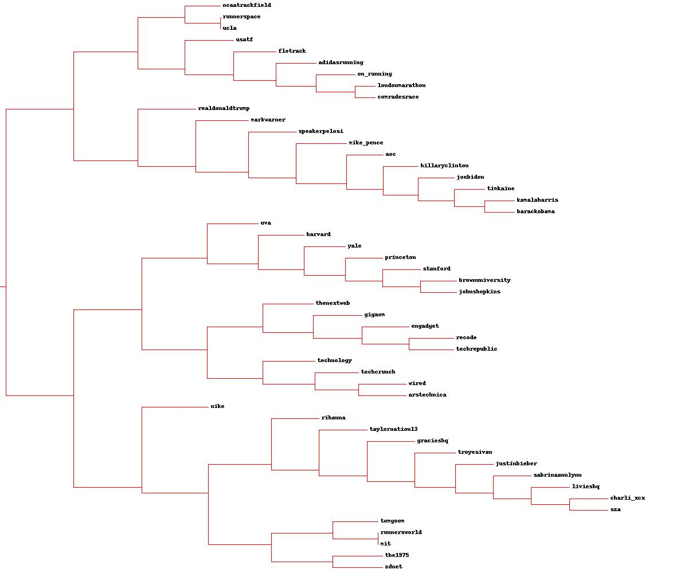

<h1 align = "center">HW 8 - Clustering</h1>

<h3 align = "center">Courtney Maynard</h3>
<h3 align = "center">DATA 440, Fall 2024</h3>
<h3 align = "center">December 5th, 2024</h3>

## Questions
### Q1: Find Popular Twitter Account
Generate a list of 50 popular accounts on Twitter with 10,000+ followers and 5000+ tweets. 

**B: What topics/categories do the accounts belong to? You don't need to specify a grouping for each account, but what general topics/categories will you expect to be revealed by the clustering? Provide this list before generating the cluster.**

I chose five distinct topics in order to search for accounts that fit the criteria. The first ten accounts are all related to running and athletics, the second ten accounts are all university accounts, the third set of ten accounts are all popular musicians' accounts or their official promotional social media accounts, the next ten accounts are accounts that post about technology, and the last group of accounts are all political figures. I expect that the clustering will identify the topical differences between these accounts and cluster them into five distinct categories. However, it is possible that the words of the tweets may reveal connections between the approximately twenty accounts belonging to people and they may cluster together. Additionally, the accounts that share information about technology may cluster with university accounts due to similar themes of education. I ran into one hiccup while scraping the tweets, which was that the scraper would not recognize tweets from accounts with capital letters. After converting all of the account names to lowercase, I was able to successfully scrape all of the tweets needed. 

### Q2: Create Account-Term Matrix
Create an account-term matrix for every term in the tweets, but only for the 500 most popular terms that are not stopwords.

#### Code:
```python
word_and_each_count = []
for each_word in wordlist:
  each_count = sumcounts[each_word]
  word_and_each_count.append((each_word, each_count))

# sort the pairs in reverse order by their count
word_and_each_count.sort(key=lambda x: x[1], reverse=True)

# get the top 500 words and their counts, but just append the word to the list
for each_word in range(500):
  popularlist.append(word_and_each_count[each_word][0])
```

I also made some changes to the scraping code in order to introduce a sleep time so that I didn't run into any problems with collecting the tweets.
```python
# only request new tweets if the data hasn't previously been written out
    account_count = 1 #ADDITION
    if (not exists("apcount.txt") or not exists("sumcounts.txt") or not exists("wordcounts.txt")):
        for screen_name in accountlist:
            print('Scrapping: ', screen_name)
            try:
                # get tweets, filter and count words
                (user, wc) = getwordcounts(browser_dets, screen_name, num_tweets=50)
                wordcounts[user] = wc
            
                # count number of accounts each term appears in
                for (word, count) in wc.items():
                    apcount.setdefault(word, 0)
                    sumcounts.setdefault(word, 0)
                    
                    apcount[word] += 1        # counting accounts with the word
                    sumcounts[word] += count  # summing total counts for the word
            except:
                print ('Failed to parse account %s' % screen_name)

            #ADDITION
            if account_count%10 == 0:
                time.sleep(900)

            account_count+=1
```

**A: Explain the general operation of generate_tweet_vector.py and how the tweets are converted to the account-term matrix.**

generate_tweet_vector.py begins by scraping twitter to get the top fifty tweets from each account contained in the accounts.txt file. In order to deal with issues caused by twitter timeouts and rate limits, it keeps in cache the data from accounts already visited. I ran the file several times to collect all the tweets, as previously visited accounts were pulled from the cache and non-visited accounts were traversed through the scraper. 

**B: Explain in detail the code that you added to filter for the 500 most frequent non-stopword terms.**

Considering that wordcounts already contained non-stopword terms, it created a list to hold tuples representing the words and their respective counts. Then, looping through each word in wordcounts, I added the respective count to the tuple and appended it to the list word_and_each_count. I then sorted the word-count pairs in reverse order, to make it easier to grab the top 500, by the count, which was the second value in the tuple and then index 1. Lastly, I created a loop to iterate through each word in the reversed-ordered list of tuples, grabbing the first 500 words and appending them to the list popularlist.

**C: Do the 500 most frequent terms make sense based on the accounts that you chose?**

Yes, the 500 most frequent terms do make sense for the different categories of accounts I chose. There are many words relating to politics and the election, which I expected to see as I chose several political figures to scrape tweets from. Most of the words also hold positive connotations, such as 'love', 'celebrate', 'champion', and 'thank'. Overall, I didn't find any terms that stood out to me as irrelevant to the categories or were very common, liken to stopwords. 

### Q3: Create Dendrogram
Create an ASCII and JPEG Dendrogram using hierarchical clustering to cluster the most similar accounts.



**A: How well did the hierarchical clustering do in grouping similar accounts together? Were there any particularly odd groupings?**

The hierarchical clustering performed very well with grouping the accounts by category, better than I thought it would. It correctly clustered all of the political figures together into their own branch system. It also was able to group a majority of the universities, seven, together, with a connecting branch to a group of eight of the technology-based accounts. These all broadly fall under the category of education, which was my initial prediction for one of the ways that the different accounts may end up clustering together. Additionally, many of the running accounts were clustered together, eight of them, with _ucla_, a university account, also appearing in the cluster on a sub-branch with _runnerspace_. My theory is that UCLA had many recent tweets talking about athletic accomplishments, thus they were grouped with the other athletic-based accounts. The hierarchical clustering also grouped nine of the musicians together, which was a surprise to me as they are a mix of official promotional accounts and personal accounts of the artists, which I thought might lead to different clustering. Additionally interesting is the closeness of _nike_ to these musician accounts. It was not clustered with the other athletics accounts, which may be because it's not only a running account but instead a corporate account. Lastly, the most peculiar grouping was the bottom cluster of _tomgoom_, _runnersworld_, and _mit_ along with _the1975_ and _zdnet_. This cluster contains four of the five categories of accounts, and it is not clear how they form a cohesive group that is also closely related to the musical artists and Nike. The hierarchical clustering performed better than the k-Means clustering at grouping by my pre-defined categories, as detailed below.

### Q4: Cluster using k-Means
Cluster the accounts using k-Means with k's of 5, 10, and 20. For each value of k, create a file that lists the accounts in each cluster.

**A: Give a brief explanation of how the k-Means algorithm operates on this data. What features is the algorithm considering?**

**B: How many iterations were required for each value of k?**
```console
(base) courtneymaynard@Courtneys-MacBook-Pro-2 data440 % python3 makingvisualizationshmwk8.py
Iteration 0
Iteration 1
Iteration 2
Iteration 3
results for k= 5 written to  k_means_clusters_k5.txt
Iteration 0
Iteration 1
Iteration 2
Iteration 3
Iteration 4
results for k= 10 written to  k_means_clusters_k10.txt
Iteration 0
Iteration 1
Iteration 2
Iteration 3
Iteration 4
results for k= 20 written to  k_means_clusters_k20.txt
```

For k = 5, four iterations were needed before the clusters converged. For k = 10 and k = 20, five iterations were needed. However, the first time I ran the clustering, when I didn't set up the output files correctly, k = 5 took six iterations, k = 10 took five iterations and k = 20 only took three iterations. This is evidence of the element of randomness present in k-Means clustering, as each try of clustering will not necessarily result in the same groups.

**C: Which k value created the most reasonable clusters? For that grouping, characterize the accounts that were clustered into each group.**

```text
k-Means clustering results for k=5
----------------------------------------------------------------------------------------------------
cluster 1:
nike, princeton, mit, ucla

cluster 2:
tomgoom, yale, brownuniversity, uva, johnshopkins, kamalaharris, timkaine, realdonaldtrump, joebiden, mike_pence, aoc, speakerpelosi, barackobama, hillaryclinton

cluster 3:
runnerspace, on_running, adidasrunning, usatf, ncaatrackfield, londonmarathon, comradesrace, flotrack

cluster 4:
the1975, technology, recode, thenextweb, techcrunch, techrepublic, engadget, gigaom, wired, arstechnica

cluster 5:
runnersworld, harvard, stanford, sabrinaannlynn, taylornation13, gracieshq, charli_xcx, troyesivan, livieshq, sza, rihanna, justinbieber, zdnet, markwarner

```
The k-value of five created the most reasonable clusters, however, there were some notable clusters formed using k = 10 and k = 20 as well. I expected that k=5 would create the most reasonable clusters, as I had five distinct categories of twitter accounts in my dataset. Cluster three was the most homogenous cluster, containing a majority of the running-related accounts, eight out of ten, and this cluster only had these eight athletics-based accounts. Cluster four was the next most homogenous cluster, containing 9 of the ten accounts that tweet about technology, and one band account, _the1975_. This grouping of _the1975_ with the majority of the technology accounts does not surprise me, as _the1975_ often focus on statements about technology, policy, and communication in the modern world as themes in their songs, which may be reflected in their tweets as well and lead to the clustering with other accounts that tweet about similar topics. Next, cluster two consists of accounts from three different categories: running, universities, and political figures. It contains nine out of ten of the political figures, as well as four universities, and one running account, _tomgoom_, which posts about running physiology tips and tricks. All of these accounts post informational content in some way - whether it is university updates, opinions on political states and current events, or running, which makes sense as to why they are grouped together. The other largest cluster is cluster five which is comprised of one running account, two universities, nine of the ten musicians/bands, one technology account, and one political figure. At first glance, it seems like this cluster is just a hodgepodge of accounts that didn't fit neatly into the other perceived groupings, however, investigation into the content of tweets by these posters and contextual information leads me to categorize this cluster as promotional/powerful language. Musical artists, especially their official accounts such as Taylor Swift's _taylornation13_ and Gracie Abrams'_ gracieshq_, often post about upcoming music, merch, or concert announcements. _zdnet_ posts about the newest and best technology gadgets, and _runnersworld_ shares news and running events. All of these accounts are effectively advertising to twitter users. I theorize that the same compelling language used in promotional tweets is used in posts by _markwarner_, _harvard_, and _stanford_, as Mark Warner may be trying to sway voters and make compelling points, while Harvard and Stanford often post links to outside news articles, encouraging viewers to read about achievements from heir universities. Lastly, cluster one, the smallest cluster contains three universities and _nike,_ the only non-running-specific athletics account, I have identified this cluster as being 'high profile'. My theory is that the language used by these accounts is very precise, as these universities and _nike_ are very well known. Their tweets are viewed by hundreds of thousands of people, and they likely desire to curate a specific image. 

Based on these observations, I would categorize the clusters as:
- Cluster One: high-profile organizations
- Cluster Two: educational/informational
- Cluster Three: running
- Cluster Four: technological commentary
- Cluster Five: promotional/powerful language

There were some interesting clusters formed by other values of k, such as cluster eight from the k = 20 iteration:

```text
cluster 8:
sabrinaannlynn, taylornation13, gracieshq, charli_xcx, troyesivan, livieshq, sza, rihanna, justinbieber, realdonaldtrump
```

which grouped eight of the musicians with Donald Trump. I thought this was an interesting grouping, as Donald Trump is just as much a celebrity as he is a political figure, something that was evidently picked up on through the language of his tweets, resulting in this cluster. 

